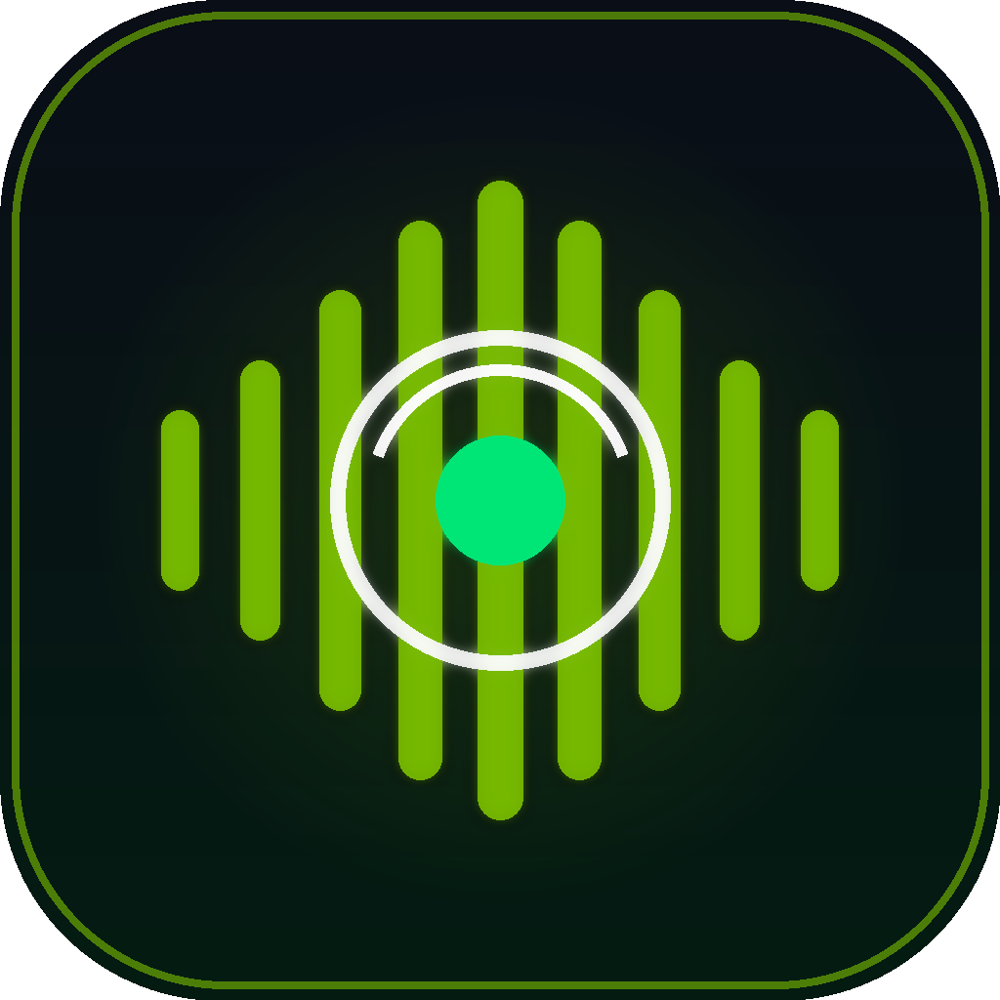

<div align="center">



# آوانمو | NeMoTalk 🎙️⚡

### کلاینت اندرویدی چت صوتی و متنی هوشمند با مدل‌های NVIDIA NeMo و Nemotron
**مکالمه صوتی زنده دوطرفه با هوش مصنوعی ان‌ویدیا به زبان فارسی و انگلیسی — ۱۰۰٪ رایگان**

[](https://github.com/HELBOYCODER/nemotalk/releases)
[](https://kotlinlang.org)
[](https://developer.android.com/jetpack/compose)
[](https://github.com/NVIDIA-NeMo/Speech)
[](LICENSE)

---

[📥 دانلود مستقیم فایل نصبی (APK)](https://github.com/HELBOYCODER/nemotalk/releases/latest) • [⚡ راهنمای دریافت کلید رایگان](#-راهنمای-دریافت-کلید-api-رایگان-ان‌ویدیا) • [🌟 ویژگی‌ها](#-ویژگی‌های-برجسته) • [🛠️ راهنمای بیلد](#-کامپایل-و-بیلد-سورس-کد)

</div>

---

## 📖 درباره پروژه NeMoTalk

پروژه **آوانمو (NeMoTalk)** یک برنامه متن‌باز و بومی اندروید است که قدرت مدل‌های مکالمه‌ای و صوتی **[NVIDIA NeMo Speech](https://github.com/NVIDIA-NeMo/Speech)** و **Nemotron** را مستقیماً در جیب شما قرار می‌دهد. 

با اتصال به سرویس ابری رسمی ان‌ویدیا (NVIDIA NIM) از طریق کلید رایگان API، شما می‌توانید به شکل صوتی و روان با هوشمندترین مدل‌های حال حاضر دنیا به زبان شیرین **فارسی** یا **انگلیسی** صحبت کنید؛ هوش مصنوعی صدای شما را تحلیل کرده، پاسخ منطقی تولید می‌کند و بلافاصله آن را به صورت صوتی برای شما می‌خواند!

---

## ✨ ویژگی‌های برجسته

- 🎙️ **گفتگوی صوتی زنده دوطرفه (Full-Duplex Voice Mode):**
  - صفحه اختصاصی گفتگوی صوتی (HUD) با ویژوالایزر متحرک نِمو و واکنش به امواج صدا
  - تشخیص گفتار با دقت بالا و پشتیبانی بی‌نقص از کلمات و عبارات فارسی
  - خوانش خودکار و بدون درنگ پاسخ‌ها با موتور صوتی تبدیل متن به گفتار (TTS)
- 🧠 **پشتیبانی از برترین مدل‌های هوش مصنوعی ان‌ویدیا:**
  - `nvidia/llama-3.1-nemotron-70b-instruct` (مدل پیشنهادی با هوش تحلیلی فوق‌العاده)
  - `nvidia/nemotron-4-340b-instruct` (غول محاسباتی ۳۴۰ میلیارد پارامتری ان‌ویدیا)
  - `nvidia/nemotron-mini-4b-instruct` (بسیار سبک و پرسرعت برای پاسخ‌های آنی)
  - `meta/llama-3.3-70b-instruct` (مدل همه‌فن‌حریف و چندزبانه)
  - `deepseek-ai/deepseek-r1` (استدلال ریاضیاتی و منطقی عمیق)
- ⚡ **رایگان بودن کامل با سرویس رسمی NVIDIA:**
  - ان‌ویدیا به تمام کاربرانی که ثبت‌نام می‌کنند **۱,۰۰۰ کردیت رایگان** (معادل ده‌ها هزار مکالمه) اختصاص می‌دهد.
- 🎨 **طراحی چشم‌نواز و مدرن (Cyber-Green Obsidian):**
  - توسعه‌یافته با مدرن‌ترین فریم‌ورک روز اندروید (**Jetpack Compose** + **Material 3**)
  - تم اختصاصی تاریک همراه با رنگ سبز درخشان ان‌ویدیا (`#76B900`)
  - آیکون اختصاصی وکتور و انطباقی (Adaptive Icons) برای انواع لانچرها
- 🔒 **امنیت و حریم خصوصی:**
  - کلید API شما فقط روی حافظه محلی گوشی (`SharedPreferences`) ذخیره می‌شود و هیچ سرور واسطه‌ای وجود ندارد؛ ارتباط مستقیماً بین گوشی شما و سرور رسمی NVIDIA برقرار می‌گردد.
- ⚙️ **شخصی‌سازی کامل:**
  - امکان تنظیم سرعت خوانش صدا، زیر و بمی صدا (Pitch)، زبان ورودی و پرامپت سیستمی دلخواه

---

## 🔑 راهنمای دریافت کلید API رایگان ان‌ویدیا

ان‌ویدیا از طریق درگاه [build.nvidia.com](https://build.nvidia.com/) به هر حساب کاربری ۱۰۰۰ کردیت هدیه جهت تست و استفاده از مدل‌های اختصاصی NeMo اعطا می‌کند:

1. وارد سایت رسمی **[NVIDIA Build](https://build.nvidia.com/)** شوید.
2. روی دکمه **Log In** یا **Sign Up** کلیک کرده و با حساب گوگل یا ایمیل خود ثبت‌نام کنید.
3. یکی از مدل‌ها (مثلاً **Nemotron-70B**) را انتخاب کرده و دکمه سبز رنگ **Get API Key** را بزنید.
4. روی **Generate Key** کلیک کرده و کلید تولید شده که با عبارت `nvapi-...` آغاز می‌شود را کپی کنید.
5. اپلیکیشن **NeMoTalk** را در گوشی باز کرده، به بخش تنظیمات (⚙️) بروید و کلید را جای‌گذاری کنید.
6. دکمه **تست اتصال** را بزنید تا از برقراری ارتباط مطمئن شوید. اکنون می‌توانید آزادانه صحبت کنید!

---

## 📲 دانلود و نصب اپلیکیشن

آخرین نسخه فایل نصبی APK را می‌توانید از بخش [Releases](https://github.com/HELBOYCODER/nemotalk/releases) دریافت و روی گوشی خود نصب کنید:

👉 **[دانلود مستقیم NeMoTalk-1.0.0.apk](https://github.com/HELBOYCODER/nemotalk/releases/latest)**

حداقل نسخه اندروید مورد نیاز: **Android 8.0 (Oreo / API 26) به بالا**

---

## 🛠️ کامپایل و بیلد سورس کد

اگر مایل به توسعه یا کامپایل برنامه از روی سورس‌کد هستید:

```bash
# ۱. کلون کردن مخزن
git clone https://github.com/HELBOYCODER/nemotalk.git
cd nemotalk

# ۲. بیلد نسخه Release یا Debug
./gradlew assembleRelease
# یا روی سیستم‌های فاقد wrapper:
gradle assembleRelease --no-daemon
```

فایل نصبی تولید شده در مسیر زیر قرار می‌گیرد:
`app/build/outputs/apk/release/NeMoTalk-1.0.0.apk`

---

## 📄 لایسنس

این پروژه تحت مجوز **[Apache License 2.0](LICENSE)** به صورت کاملاً آزاد و رایگان منتشر شده است. استفاده و توسعه آن برای عموم کاربران بلامانع است.

---

<div align="center">
ساخته‌شده با ❤️ و انرژی توسط <b><a href="https://github.com/HELBOYCODER">Helboy Coder</a></b>
</div>
